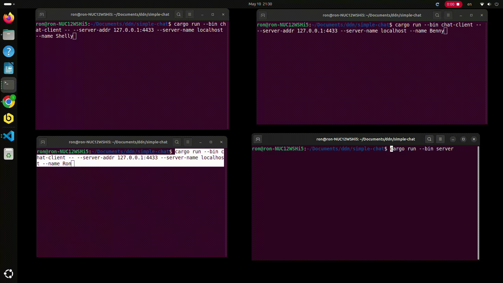

# Simple Chat

## Summary

You have been tasked with writing a simple asynchronous chat server and CLI
client.

Since this is a simple chat server there is only a single room. Users may
freely join or leave this room. They may also send messages to the room, which
will be sent to all connected users minus the sender.

Even though the server is simple, it has high throughput. Because of this, all
code should be non-blocking for maximum concurrency.

The following is a rough specification of the server and client.

## Server

* The servers job is to manage users.
* It should be able to receive a message from a user and process it.
* The user may wish to join, leave or send a message through the chat server.
* Any other user who is currently connected should get the message sent to
them.
* The user who sent the message should not get the message.
* When a user sends a leave message, or disconnects their client, the server
should no longer send messages to them, and do any internal bookkeeping to 
clean up.
* Username's should be unique.
* The server should be able to support many users without a large delay
* The server should be able to support many users with a small memory footprint


## Client

* The client is an async CLI program.
* It is responsible for sending messages to the server and displaying any
messages from the server.
* The client should accept environment variables or command line arguments
indicating the host and port where the server is listening. It should also
accept a username that will be used as an identifier on the server.
* The client should automatically connect to the chat server upon 
initialization using the specified host and port.
* The client should display an interactive command prompt. The prompt should 
be able to handle the following inputs:
    * `send <MSG>`  where `<MSG>`  is the message that should be sent to the 
    server
    * `leave` this will disconnect the client from the server and exit the CLI.


## Additional Requirements

* Your source should contain both unit and integration tests where necessary.
* All code must be formatted using the standard formatting tool.
* Code must compile without clippy errors.

## Submission

Please fork this repository to your own GitHub account and submit a pull
request to your own repository. Your pull request should include a
video of a working demo at the top along with any other key information
that should be highlighted. A link to the pull request can be submitted when
it is ready for review.

## Bonus

* Include a pre-commit hook that will ensure that all code is formatted, compiles
without error, and is free of clippy errors.
* Create a GitHub Action that will launch your chat server and attempt to 
send a message to the server from the client. Make sure that niether the server
or client exit with a failure. This action should be run anytime new code
is pushed to a branch or landed on the main branch.

### Demo


## Getting Started

### 1. Install Git Pre-Commit Hook

To ensure all code is formatted, compiles correctly, and passes Clippy checks before committing, run the following script once after cloning the repository:

```bash
bash scripts/install-hooks.sh
```
### 2. Install Protocol Buffers (protoc)
This project uses Protocol Buffers (Protobuf) for serializing structured data. In order to compile .proto files, you need to have the protoc compiler installed.

Follow the instructions for your operating system here:
https://protobuf.dev/installation/

Make sure protoc is available in your PATH:
```bash
protoc --version
```
Should output something like: libprotoc 3.21.12

Note: Some components of this project might auto-generate code from .proto files during the build process. Ensure protoc is installed and accessible before building or running the project.

### 3. Run Server
```bash
cargo run --bin server
```

### 4. Run Client
```bash
cargo run --bin client
```

### 4. Run Tests
```bash
cargo run --bin server
```
In other terminal
```bash
cargo test
```